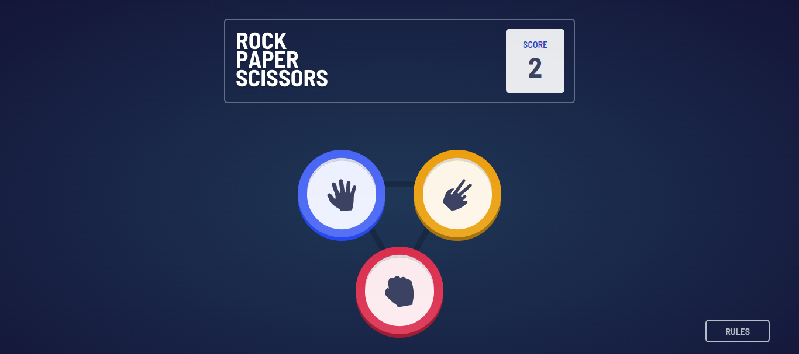

# Frontend Mentor - Rock, Paper, Scissors solution

This is a solution to the [Rock, Paper, Scissors challenge on Frontend Mentor](https://www.frontendmentor.io/challenges/rock-paper-scissors-game-pTgwgvgH). Frontend Mentor challenges help you improve your coding skills by building realistic projects.

## Table of contents

- [Overview](#overview)
  - [The challenge](#the-challenge)
  - [Screenshot](#screenshot)
  - [Links](#links)
- [My process](#my-process)
  - [Built with](#built-with)
  - [What I learned](#what-i-learned)
- [Author](#author)

## Overview

### The challenge

Users should be able to:

- View the optimal layout for the game depending on their device's screen size
- Play Rock, Paper, Scissors against the computer

### Screenshot

### Links

- Solution URL: (https://www.frontendmentor.io/solutions/rock-paper-scissors-game-using-react-and-vanilla-css-Z_L4oXVZyY)
- Live Site URL: (https://jajankenn.netlify.app/)

## My process

### Built with

- Semantic HTML5 markup
- CSS custom properties
- Flexbox
- CSS Grid
- Mobile-first workflow
- [React](https://reactjs.org/) - JS library

### What I learned

- Page transitions using conditional logic.
- Replicate click animation with active pseudo-class.

## Author

- Frontend Mentor - [@yourusername](https://www.frontendmentor.io/profile/peterxavier01)
- Twitter - [@peter_uadiale](https://twitter.com/peter_uadiale)
